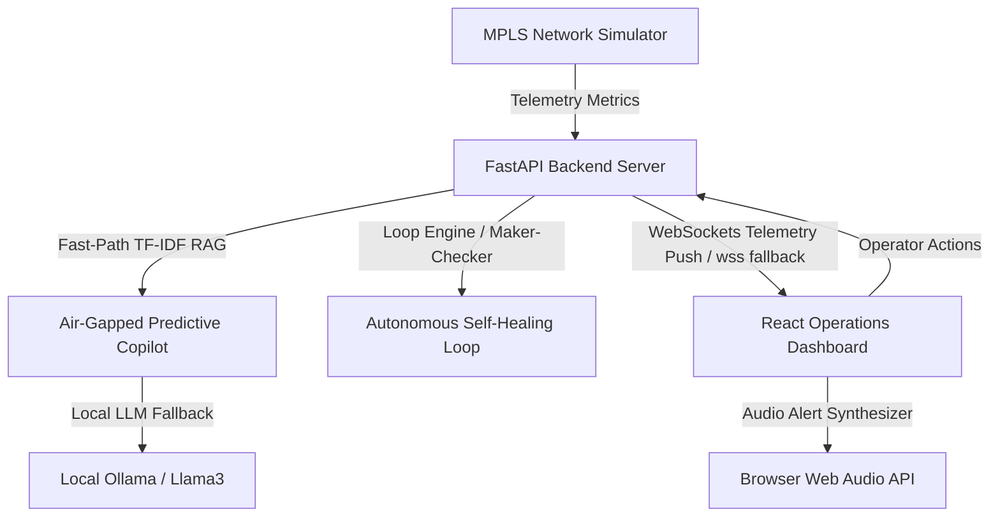

# 🛰️ Air-Gapped Predictive Copilot & Secure NOC Operations Dashboard

An enterprise-grade, air-gapped network management and self-healing orchestration cockpit built for secure Space & Defense operations (representing a mission-critical **ISRO Network Operations Center**). This platform features real-time predictive anomaly diagnostics, local RAG document-grounded AI copilot, an autonomous maker-checker loop engineering engine, and browser-native security audit notifications.

---

## 📸 Architecture & Data Flow

Below is the real-time push telemetry architecture of the secure operations portal:



---

## 🚀 Key Feature Catalog

Everything in this portal is built to run entirely offline, meeting the strictest regulatory compliance requirements for air-gapped government infrastructure.

### 1. 🔐 Secure holographic operator clearance portal
* **Operator ID clearance gate:** Gates portal operations behind credentials (`ISRO-NOC-77` / `isronoc2026`).
* **Holographic visuals:** Styled with glassmorphism overlays, laser scanning animations, and token decryption progress sequences.
* **Auto-unlock sound context:** Clicking the authentication button unlocks browser AudioContext permissions for audible alerts.

### 2. 📈 Live telemetry trends & SVG sparkline charts
* **Geographically realistic Indian routing metrics:** Calibrated latency baselines corresponding to physical fiber distances in India (New Delhi Hub ~0.8ms, Delhi-Mumbai ~8.4ms, Delhi-Guwahati/Northeast ~46.2ms, Chennai ~31.8ms).
* **Live sparklines:** Real-time inline SVG graphs rendering metric fluctuations next to each branch site.
* **Global SLA area chart:** High-resolution average SLA latency area graph with gradient fill.

### 3. 🔄 NOC Incident Lifecycle Timeline
* **Horizontal tracker cards:** Renders at the bottom of the overview dashboard detailing the full history of self-healing operations.
* **State progressions:** Color-coded status dots (`Incident Triggered` [Red] ➔ `Loop Engaged` [Purple] ➔ `Verified Recovery` [Green]).
* **Pulsing nodes:** Pulsing animations on indicators for currently active mitigation phases.

### 4. ⚙️ Autonomous Loop Engineering (Maker-Checker Panel)
* **n8n-style node map:** Visualizes the loop orchestration pipeline connecting Triage ➔ Mitigation ➔ Verification ➔ Resolution.
* **Maker-Checker verification checklists:** Requires scripts to run, telemetry to normalize, and health checks to clear before resolving an incident.
* **Live status widget:** Embedded directly on the overview cockpit displaying active verification loops, progress fill bars, and current loop logs.

### 5. 🛡️ Bandwidth Abuser Security Alerts
* **Congestion simulation:** Simulates non-business packet hogs (YouTube 4K streams, BitTorrent downloads, Facebook scrolls) causing branch link saturation.
* **Holographic warning toasts:** Displays custom warning cards ("YouTube traffic detected on branch-pune, 2.3GB wasted").
* **Interactive rate-limiting:** "Deploy Rate-Limiter QoS" button feeds QoS blocking rules directly into the Copilot chat queue.

### 6. 🔊 Audible NOC Alarm Notifications
* **Double chirp chime:** Plays double high-pitched sine beep for `CRITICAL` alert triggers.
* **Warm warning tone:** Plays a soft triangle tone for `WARNING` alert triggers.
* **Browser-native synthesis:** Synthesizes sound using the HTML5 Web Audio API, avoiding media file downloads and running in offline environments.

### 7. 📄 One-Click PDF executive reporting
* **Print layout template:** Renders clean, print-ready reports containing executive summaries, incident timelines, and SLA metrics.
* **Native print trigger:** Launches native browser printing to export professional PDFs.

---

## 🛠️ How to Run Locally

Follow these instructions to start the air-gapped system on your local machine.

### Prerequisites
* **Python 3.10+** (with virtual environment support)
* **Node.js 18+** (with npm)
* **Ollama** (optional, for local LLM text generation)

### 1. Initialize Backend Server
1. Clone the repository and navigate to the project directory:
   ```bash
   cd Air-Gapped-Predictive-Copilot-for-Secure-MPLS-Operations
   ```
2. Create and activate a Python virtual environment:
   ```bash
   python -m venv .venv
   .venv\Scripts\activate  # Windows Powershell
   # or source .venv/bin/activate on Linux/Mac
   ```
3. Install Python dependencies:
   ```bash
   pip install -r requirements.txt
   ```
4. Start the FastAPI uvicorn server on port `8000`:
   ```bash
   $env:PYTHONPATH="."  # Windows
   python -m uvicorn backend.main:app --host 0.0.0.0 --port 8000 --reload
   ```

### 2. Initialize Frontend Client
1. Open a new terminal and navigate to the frontend directory:
   ```bash
   cd frontend
   ```
2. Install npm dependencies:
   ```bash
   npm install
   ```
3. Start the Vite React development server on port `5173`:
   ```bash
   npm run dev
   ```
4. Access the portal at [http://localhost:5173](http://localhost:5173).

---

## 🤖 Air-Gapped Copilot Query Reference

The Predictive Copilot leverages a local vector store (ChromaDB) to ground queries in local network SOP documents. If a local Ollama model is unavailable, the copilot falls back to a deterministic, high-speed matching fast-path.

* **BGP peer issues query:** `"What are the standard troubleshooting steps for BGP flaps on Chennai PE router?"`
* **Bandwidth abuser query:** `"Who is using BitTorrent / YouTube right now?"`
* **Status report query:** `"Show current active bandwidth abuse report"`
* **Loop status query:** `"What is the current status of Bengaluru link self-healing loop?"`
